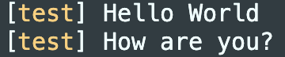

# printstream

A Python library that enhances the built-in print function for better debugging.

## Table of Contents
1. [Features](#features)
2. [Installation](#installation)
3. [Usage](#usage)
4. [Configuration](#configuration)
5. [Examples](#examples)
6. [Overhead Measurement](#overhead-measurement)
7. [Contribution](#contribution)
8. [License](#license)
9. [Contact](#contact)

## Features
- Prepend function name to print output.
- Colorize function name based on hash for better visual distinction.
- Align print output for improved readability.
- Toggle enhanced print functionality on and off as needed.
- Highly configurable via simple API.
- Lightweight with minimal setup.

## Installation
Install `printstream` via pip:
```bash
pip install printstream
```

## Usage
Import and activate the library at the top of your script:
```python
from printstream import activate, deactivate

activate()

# Your code here...

deactivate()
```

## Configuration
Configure `printstream` to suit your needs:
```python
from printstream import (activate, deactivate, set_align, set_colorize,
                         set_format, set_level, set_output,
                         set_repeat_func_name, set_show_variables)tivate, deactivate)

# Configure the debugger
set_format("[{func_name}] {message}")
set_align(False)
set_repeat_func_name(True)
set_show_variables(False)
set_colorize(True)
set_level(1)

activate()

# Your code here...

deactivate()
```

### Additional Configuration Details

Here are some additional details about the configuration options:

- `align`: If `repeat_func_name` is set to `False` and `align` is set to `True`, the output of a single print statement with newlines will be indented such that the output is fully aligned.

`align` and `repeat_func_name` set to `False`:
```
[test] Hello World
How are you?
```

- `repeat_func_name`: If a print statement has newlines, and this option is set to `True`, it will still print the function name before each line (even within the same print statement).

```
[test] Hello World
[test] How are you?
```

- `colorize`: This option colorizes the function name based on its hash. This introduces some significant overhead (~200%). If anyone has any suggestions on improvements, please submit a PR.




- `levels`: This option controls the output level.
  - `-1`: No output
  - `0`: Normal print
  - `1`: Debug activated


## Examples
Example with `printstream` activated:
```python
from printstream import activate, deactivate

activate()

def test_func_name():
    print("Hello World\nHow are you?")

def test_variable_info(name):
    print(f"Hello {name}!")

test_func_name()
test_variable_info("John")

deactivate()
```

Output:
```plaintext
[test] Hello World
[test] How are you?
[test2] [name=John] Hello John!
```

## Overhead Measurement
Measure the overhead of `printstream`:
```python
import timeit

# ... setup code ...

# Measure time with standard print
time_without_debug = timeit.timeit("test()", setup=setup_code, number=10)

# Measure time with printstream activated
time_with_debug = timeit.timeit("activate(); test(); deactivate()", setup=setup_code, number=10)

# Calculate overhead percentage
overhead_percentage = ((time_with_debug - time_without_debug) / time_without_debug) * 100
```

## Contribution
Contributions to `printstream` are welcome! Please submit a pull request or create an issue on the [GitHub repository](https://github.com/arnav-ag/printstream).

## License
`printstream` is licensed under the MIT License. See the [LICENSE](LICENSE) file for details.

## Contact
- Author: Arnav
- Email: arnavaggarwalwork@gmail.com